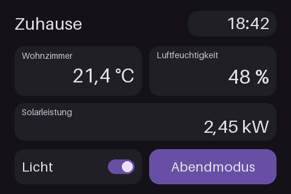
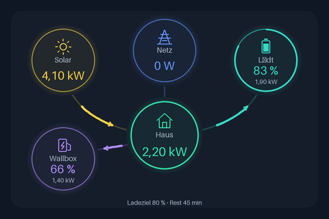
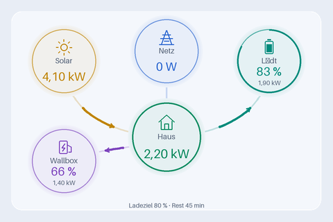

# Desk Display for Home Assistant

[Deutsch](README.md) · [Installation](#installation) · [Firmware & releases](https://github.com/rbnstn/ha-desk-display-hacs/releases) · [Notifications & automations](docs/AUTOMATIONS.md)

**Your Home Assistant dashboard on a small touchscreen.** Arrange sensors, energy flows, switches, weather and cameras in a visual designer. Home Assistant renders the screen; a lightweight ESP32 firmware receives image data and sends touch events back.

| Dashboard with sensors and touch controls | Energy flow with battery and EV charging |
| :---: | :---: |
|  |  |

*These images come from the actual renderer using sample values. They are not photographs of a physical device. The project is actively developed and currently targets the E32R35T only. The designer currently uses German labels; the instructions below include the corresponding labels.*

## New in 0.31.0

[Interactive demo](https://rbnstn.github.io/ha-desk-display-hacs/) · [Browser installation and recovery](https://rbnstn.github.io/ha-desk-display-hacs/install.html)

- **Setup wizard:** Check the connection, choose up to three sensors and create a first page as a draft while preserving existing pages.
- **HA templates:** Store up to eight personal pages/components per user centrally in Home Assistant. Existing browser templates migrate when central storage is empty.
- **Multiple displays:** Copy a layout from another display and rebind its entities. The target display retains its brightness and sleep settings.
- **Text:** Up to six lines and 240 characters; sans, serif or monospace; normal/bold; top/middle/bottom alignment; separate size and color for units. Bundled DejaVu font variants support Latin, Greek and Cyrillic characters.
- **Data quality:** Show missing values, hide their widgets or show replacement text. Optionally show sensor age and mark stale readings at a chosen threshold. Age uses the last HA state report; it does not guarantee a fresh physical measurement.
- **New cards:** Daily generation, consumption, import and export in kWh; self sufficiency/self consumption from existing percentage sensors; EV charge with target and progress bar; HA calendars with up to five events over 1–14 days.
- **Electricity prices:** Current price per kWh, cheapest slot and cheap windows. Normalize the sensor to the selected currency per kWh. Supply a `prices` attribute: `[{"start":"2026-10-06T15:00:00+02:00","price":0.12}]`. Providers with different attributes require a HA template sensor.
- **State icons:** Up to four conditional icons per icon/chip widget, for example an open/closed window. Entity selection grouped by HA area and device.
- **Touch and notices:** Tap a camera for a 30-second enlarged view with a Back button. Dismiss notices with × on the right; optionally tap on the left to execute an explicitly configured button/script. Notices wake the display at the configured priority (default 2); 4 disables this.
- **Pages:** Time windows using HA local time and weekdays, including overnight windows. Page rules can trigger on state change or hold a page while a condition matches, including person/presence entities. Doorbell and temporary pages take precedence.
- **Native update entities:** Integration version notice links to the release; install it through HACS. Firmware updates install through the HA update entity and verify restart and version.

### First installation in your browser

1. Open the HTTPS [installer](https://rbnstn.github.io/ha-desk-display-hacs/install.html) in desktop Chrome or Edge.
2. Connect an E32R35T with a USB data cable, choose a release, click **Connect and install**, and select the correct serial port.
3. After installation, configure Wi-Fi and a device key using the access point shown on the display. Set up the integration in HA with the IP address and device key.

New releases include the OTA binary, a complete `*-factory.bin`, bootloader, partition table, `boot_app0.bin`, SHA256 files and `web-install-manifest.json`. The installer writes individual parts at the proper flash offsets. The plain `.bin` is for OTA; do not upload the factory binary through OTA.

### Recovery

After a failed update, choose a previous release from 0.31.0 onward in the browser installer. Older releases have no web installation package. If connection fails, hold BOOT while connecting USB and release it after connecting. **Erase device** removes Wi-Fi, key and touch calibration; configure them again afterward.

Alternatively write the release factory image at address `0x0` with `esptool`. Its padded image also resets Wi-Fi and the key. HA layouts and templates remain stored. Automatic firmware rollback after a bad boot is not implemented; USB recovery works independently of the running application.

The interactive demo uses sample data and simplified browser rendering. To try the actual designer without hardware, download the development project, install Pillow and run `python tools/preview.py`.


## Features

| Area | Capabilities |
| --- | --- |
| Designer | Drag, resize, grid, snap to edges and centres, spacing guides, multiple selection, groups, even spacing, undo/redo, lock and hide |
| Text and sensors | Left/centre/right alignment, automatic font fitting, format presets, W/kW conversion, decimal places, comma/dot separator, custom units and fallback sensors |
| Energy | Solar, home, import/export, battery charging/discharging and charge level; optional wallbox, car charge level, charging target and remaining time |
| Touch controls | Buttons, switches, sliders, media controls, long press and optional confirmation |
| Other widgets | Time, date, images, HA icons, history charts, progress, gauges, status chips, energy costs, weather and countdowns |
| Pages | Up to four pages with ten widgets each; touch navigation, swipe, rotation and conditional page changes |
| Doorbell | Camera, door opener and state, custom doorbell screen, camera preparation and limited ringing history |
| Notifications | Up to eight conditional rules, priorities and automatic expiry; HA automations also supported |
| Templates | Built-in templates, personal pages and components, JSON import/export and three previous saved layouts |
| Preview | Real HA states, simulated values and a side-by-side comparison of saved screen and current draft |
| Device | Brightness, night mode, sleep mode, diagnostics, Wi-Fi firmware upload and a combined update check |

## Supported hardware

| Device / requirement | Support |
| --- | --- |
| **LCDWIKI E32R35T** | Target device: ESP32, 3.5-inch 480 × 320 landscape display, ST7796 driver and XPT2046 touch |
| Other ESP32 displays | No ready-to-use firmware. Controller, pin assignments and dimensions require explicit changes. |
| ESP32-8048S043 / GeekMagic devices | Not compatible with this firmware. Similar names or cases do not establish compatibility. |
| Home Assistant | **2026.9 or newer**; HA CI currently tests 2026.9.4 |
| Network | 2.4 GHz Wi-Fi; HA must reach the display locally over TCP port 80. |

No audio. Camera/video widgets update at most once per second. This project is not a tablet or a full Lovelace interface. HACS installs the integration, **not** the display firmware.

## Installation

### 1. Install firmware over USB for the first time

You need an E32R35T, a USB data cable, Python 3.12 and access to the serial port.

1. Open the [public repository](https://github.com/rbnstn/ha-desk-display-hacs), choose **Code → Download ZIP** and extract it. Alternatively clone it with Git.
2. Open a terminal in the extracted project directory.
3. Install PlatformIO, build and flash:

```sh
python -m pip install "platformio==6.1.18"
python -m platformio run --project-dir firmware --target upload
```

When several serial devices are connected, add `--upload-port COM3` on Windows or `--upload-port /dev/ttyUSB0` on Linux, using your actual port. Linux users need permission to access the serial device.

Details: [PlatformIO upload command](https://docs.platformio.org/en/latest/core/userguide/cmd_run.html).

If uploading does not start, hold BOOT, briefly press RESET and release BOOT when the upload begins. The first PlatformIO upload writes the bootloader and partition table as well. **The individual release `.bin` is intended for later application/OTA updates and does not replace the complete first USB upload.**

The public build does not need `secrets.h`. Flashing replaces the manufacturer's firmware.

### 2. Configure Wi-Fi on the display

1. Connect to the **DeskDisplay-…** Wi-Fi network shown on the display using the displayed password.
2. Open **http://192.168.4.1** in your browser.
3. Enter your 2.4 GHz Wi-Fi name and password.
4. Copy the **Geräteschlüssel** (device key) from the form and keep it safely. Home Assistant will need it.
5. Save and connect. Find the display's local IP address in your router and preferably assign a fixed DHCP lease.

To reopen Wi-Fi setup, hold BOOT for about eight seconds, then release it. Releasing after about three seconds starts touch calibration instead. Credentials are stored locally on the device; public firmware contains no Wi-Fi credentials.

### 3. Install the integration using HACS

Set up HACS first: [official installation instructions](https://www.hacs.dev/docs/use/download/download/) and [custom repositories](https://www.hacs.dev/docs/faq/custom_repositories/).

1. Open HACS and add a **Custom repository** with this URL:
   `https://github.com/rbnstn/ha-desk-display-hacs`
2. Choose category **Integration**.
3. Download **Desk Display** and restart Home Assistant.
4. Open **Settings → Devices & services → Add integration → Desk Display**.
5. Enter the local display IP without `http://` and the saved device key. An automatically discovered display can also be configured.
6. Open **Desk Display** in the sidebar. The designer is available to HA administrators.

Manual alternative: copy `custom_components/desk_display` to `/config/custom_components/desk_display`, then restart HA. Keep the existing integration when switching to HACS.

### 4. Create your first screen

1. Select your display in the designer.
2. Choose **Element hinzufügen** (add widget) or a template under **Display → Vorlagen**.
3. Assign HA sensors and actions, then drag and resize widgets.
4. Under **Aussehen** (appearance), set colours, alignment and **Schrift automatisch anpassen** (automatic font fitting).
5. Choose **Layout prüfen** (check layout), review the preview, then **Speichern & übertragen** (save and send).

Energy flow requires four power sensors. Battery/car charge sensors must use percentages. Remaining charging time accepts `s`, `min` or `h`. Positive grid/battery values feed the home; negative values represent export or charging. Invert the sign in the widget if your sensors use the opposite convention. Home consumption comes directly from the selected sensor; wallbox consumption is not added again.

The wallbox circle is hidden without a wallbox sensor. Power remains visible without a charge sensor. Unknown readings are shown as missing rather than an invented zero.

## Updating

- **Integration:** download the HACS update, restart HA and reload the designer. If old fields remain visible, use `⌘ + Shift + R` on macOS or `Ctrl + F5` on Windows/Linux.
- **Firmware:** under **Display → Firmware aktualisieren → Updates prüfen**, inspect installed and available versions. Download the matching E32R35T `.bin` from the [release](https://github.com/rbnstn/ha-desk-display-hacs/releases), select it and install. Wi-Fi updates require installed firmware 0.6.0 or later. Update older versions over USB first.
- Firmware 0.9.0 supports device Wi-Fi setup and sleep mode. Integration 0.31.0 adds HA-side designer features and does not require a newer firmware version.
- Publishing an integration release automatically builds firmware and attaches the `.bin`, SHA-256 checksum and metadata. Several integration releases may use the same firmware version.

## Personal templates, notifications and backups

Under **Display → Vorlagen**, save up to eight personal templates per HA user centrally in Home Assistant. They are available in other browsers signed in as the same user. Export/import JSON files for sharing. A page template adds a new page; a component adds widgets to the current page. Exports exclude device and Wi-Fi keys but may include sensor IDs and personal images.

Use **Display → Hinweise & Meldungen** for window, appliance or power notifications. A message appears when a condition changes from false to true, then expires automatically. Already active conditions are not replayed on startup. Doorbell screens take priority. [Automation examples in German and English](docs/AUTOMATIONS.md).



## Troubleshooting

| Problem | Check |
| --- | --- |
| Display offline | Wi-Fi, local IP, device key and access from HA. Change its IP through the integration's **Reconfigure** action. |
| Black/incorrect image after flashing | Exact E32R35T board, complete first USB upload and power supply. |
| Inaccurate touch | Hold BOOT for about three seconds and release; complete touch calibration. |
| Missing new designer controls | Installed HACS version, HA restart and a full browser reload. |
| Text too large | Enable automatic fitting or use the one-time fit button. The minimum is 12 px; enlarge the widget if necessary. |
| Incorrect power value | HA unit, conversion factor and sign convention. Use custom factors deliberately. |
| Slow camera | One video widget per page, at most one frame per second; check the network and camera preparation. |
| Update check fails | HA needs internet access to GitHub. Retry later or open the release directly. |

Keep communication local and do not expose the display port to the internet. Touch controls can trigger real HA actions; previews and simulations do not execute them.

## Development

CI checks Python tests, Chromium interactions, current HA contracts, firmware builds and HACS validation. Automated checks do not replace physical-device testing. Images are reproducible using `python tools/render_readme.py` in the development repository. Development: [ha-desk-display](https://github.com/rbnstn/ha-desk-display); HACS/firmware: [ha-desk-display-hacs](https://github.com/rbnstn/ha-desk-display-hacs).

Inspired by [GeekMagic HACS](https://github.com/adrienbrault/geekmagic-hacs). This is an independent implementation and contains no copied GeekMagic code.


